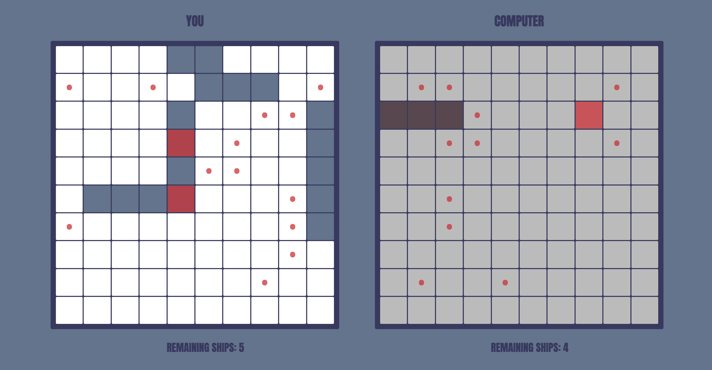

# Battleship

**Playable web version of the classic game Battleship**

This is a small game that lets you play Battleship against a CPU. Piece placement is randomly generated and you can target the opponent's ships by clicking.

I completed this project as coursework for The Odin Project's Unit Testing module ([assignment page](https://www.theodinproject.com/lessons/node-path-javascript-battleship)).

- **Live demo:** [https://stephengroe.github.io/top-battleship/](https://stephengroe.github.io/top-battleship/)
- **Built with:** JavaScript, Webpack, Jest, HTML5, CSS3
- **License:** MIT

## Features

### Basic Battleship gameplay

Target enemy ships and see a response of hit, miss, or hit and sunk. See when a complete ship sinks with a GUI animation. When the game is over, see how many moves it took you (or your opponent) to win.

### Expandable variability

The core game mechanics can accept boards of any square dimension, and any number of ships with any length. The default is standard gameplay: a 10x10 board and five ships of 5, 4, 3, 3, and 2 squares.

## Improvements

Because this is a small demo project, I might not set aside time to make these changes—but here's where I'd start!

* **Drag-and-drop piece placement.** Right now, piece placement is generated randomly. I'd like to be able to let players customize where they place their ships.

* **Multiplayer mode.** It'd be nice to play with a friend instead of just against the computer.

* **Better CPU gameplay.** The current computer player is, well, less than intelligent. Its logic restricts it to legal moves, but they're all completely random. I'd like to add logic to target entire ships and empty spaces on the board.

* **UI improvements and animations.** I'd like to improve the user interface a bit and include sleeker animations for moves, like animated hits on targets.